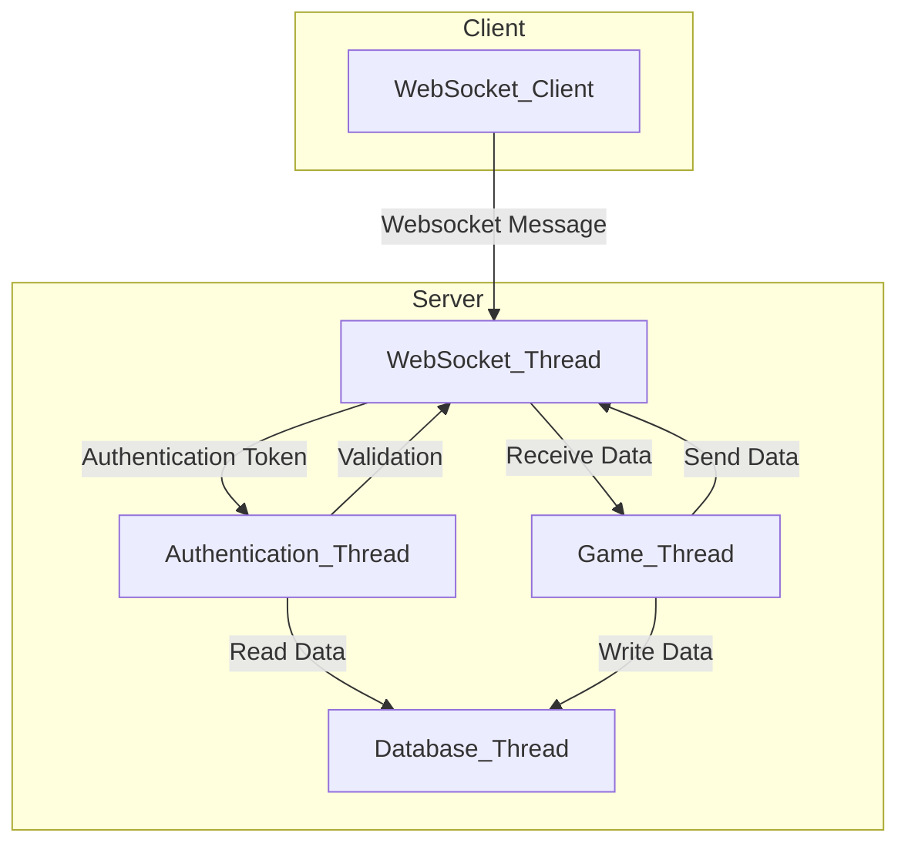

# Architecture

Tiny Lobby is designed for scalability and performance using a multi-threaded architecture and lockfree queues. It uses the following threads:

- Websocket Thread: Receives and Sends messages to clients. Connects 1-1 to: Game Thread through a queue, and to Authentication Thread through a queue.
- Authentication Thread: Does validation of tokens and loads data from database.
- Database Thread: Used by Game Thread to write data asynchronously.
- Game Thread: Receives messages, updates lobby state or runs scripts and sends response back to the Websocket Thread through a queue.



- WebSocket Thread: Handles all client connections and message routing.
- Game Thread: Manages lobby state and logic.
- Database Thread: Handles database operations.
- Authentication Thread: Processes login and token validation.

## Features

Tiny Lobby provides a rich set of features, sent as messages that can be batched. Messages are typically sent as JSON objects with short keys for efficiency. Each message includes a command type, relevant data, and optional metadata.

### Lobby Management

Any peer can:

- Create a new lobby.
- Join a lobby and receive its state.
- Leave the lobby.
- Get lobby public data.
- Get lobby tags
- Get a list of lobbies.
- Receive notification when a peer joins.
- Receive notification when a peer leaves.
- Receive notification when a peer is kicked.
- Call lobby scripted functions.

Only the host of a lobby can:

- Change lobby sealed (locked/open) state.
- Change max players.
- Set or remove lobby password.
- Change lobby title.
- Set lobby tags.

### Peer Management

Peers are able to:
- Receive initial state
- Set or unset ready state.
- Set or update user data.
- Send chat messages.
- Receive notification when a peer reconnects or disconnects.
- Receive notification when a peer sets user data.
- Receive notification when a peer public data is updated, or when own private data is updated.
- Receive chat messages.

## Protocol

The protocol is using websockets. When connecting to the server, you need to provide in protocols:
- as first protocol `appsinacup`.
- as second protocol the `game_id`.
- optionally as third protocol the `reconnection_token`. If none is provided one will be generated for you.

From here on, after you connect, you will receive one initial response, afterwards you will be able to send commands and will receive responses to those.

### Message

A message is a json object. For the case of commands (client sent) it's a single json object, for the case of responses (server sent) it's either a single json or an array of messages (if batched).

The message for responses is of the following form:

```json
{
    "c": 1,
    "d": {},
    "m": "Message",
    "e": true
}
```

Where:
- `c` is the `COMMAND`: This is an integer corresponding to the response type id.
- `d` is the `DATA`: This is a dictionary corresponding to the data of the response.
- `e` is the `IS_LOGICAL_ERROR`: In the case of an error message, is this a user error or a server error.
- `m` is the `MESSAGE`: For server errors, this returns the error message.

The message for commands is of the following form:

```json
{
    "c": 1,
    "d": {}
}
```

Where:
- `c` is the `COMMAND`: This is an integer corresponding to the command type id.
- `d` is the `DATA`: This is a dictionary corresponding to the data of the command.

In both of the response and command, inside the `data` there is a special `id` field which is used for asynchronous messages (determining if the response is a response to a previous command). When issuing a command, if you put inside the data an `id` with a number, the same `id` will be received back when receiving a response.

Eg.:

- Command:

```json
{
    "c": 7,
    "d": {
        "id": 13
    }
}
```

- Response:

```json
{
    "c": 8,
    "d": {
        "id": 13
    }
}
```

The command numbers in the example above are fictive.

### Models


The lobby data will look like this:

```json
{
    "id": "abc", // lobby id
    "n": "lobby_name", // lobby name
    "h": "host_id", // host id
    "s": true, // sealed state
    "m": 4, // max peers
    "p": ["host_id"], // peer ids
    "_p": false, // has password
    "c": 123456, // created time
    "t": { "tag1": "value1" }, // tags
    "d": { "data": "value" }, // public data
    "_d": { "data": "value" }, // private data
}
```

The peer data will look like this:

```json
{
    "id": "abc", // peer id
    "oi": 1, // order id
    "ud": { "user_data": "value" }, // user data
    "r": false, // ready state
    "l": "lobby_id", // lobby id
    "d": { "public_data": "value" }, // public data
    "dc": false, // disconnect state
    "p": "anon", // platform
    "rt": "abc123", // reconnection token
    "_d": { "private_data": "value" } // private data
}
```

### Responses

Responses sent from the server.

#### RESPONSE_ERROR

This response is sent when an error occurs. It can be either a script error or a server error.

```json
// This is an error thrown by the server
{
    "c": 0,
    "m": "Game not found"
}
```

```json
// This is an error thrown from the script by the developer
{
    "c": 0,
    "m": "The player cannot move to the left", // the message
    "e": true // is logical error
}
```

#### RESPONSE_LOBBY_HOSTED

This response is sent when a lobby host is changed. The new `host_id` is sent.

```json
{
    "c": 1,
    "d": { 
        "h": "host_id" // host id
    }
}
```

#### RESPONSE_LOBBY_CREATED

This response is sent when a lobby is created. The `lobby` and `peers` are sent.

```json
{
    "c": 2,
    "d": { 
        "l": {
            // Lobby Model
        },
        "p": [
            {
                // Peer Model
            }
        ]
    }
}
```

#### RESPONSE_LOBBY_UNSEALED

This response is sent when a lobby is unsealed.

```json
{
    "c": 3,
    "d": {}
}
```

#### RESPONSE_LOBBY_SEALED

This response is sent when a lobby is sealed.

```json
{
    "c": 4,
    "d": {}
}
```

#### RESPONSE_LOBBY_RESIZED

This is a response sent when a lobby is resized.

```json
{
    "c": 5,
    "d": {
        "m": 4 // max peers
    }
}
```

#### RESPONSE_LOBBY_PASSWORDED

This is a response sent when a lobby password state changed.

```json
{
    "c": 6,
    "d": {
        "_p": true // if this lobby has a password
    }
}
```

#### RESPONSE_LOBBY_TITLED

This is a response sent when a lobby title changed.

```json
{
    "c": 7,
    "d": {
        "n": "title" // the lobby title
    }
}
```

#### RESPONSE_PEER_READY

This is a response sent when a peer is ready.

```json
{
    "c": 8,
    "d": {
        "p": "peer_id" // peer id
    }
}
```

#### RESPONSE_PEER_UNREADY

This is a response sent when a peer is unready.

```json
{
    "c": 9,
    "d": {
        "p": "peer_id" // peer id
    }
}
```

#### RESPONSE_LOBBY_LEFT

This is a response sent when you leave a lobby.

```json
{
    "c": 10,
    "d": {}
}
```

#### RESPONSE_PEER_LEFT

This is a response sent when a peer leaves a lobby.

```json
{
    "c": 11,
    "d": {
        "p": "peer_id", // peer id
        "k": true // if you were kicked form the lobby
    }
}
```

#### RESPONSE_LOBBY_KICKED

This is a response sent when you are kicked from a lobby.

```json
{
    "c": 12,
    "d": {}
}
```

#### RESPONSE_PEER_STATE

This is a response sent when you connect to the server.

```json
{
    "c": 13,
    "d": {
        "p": {
            // Peer Model
        }
    }
}
```

#### RESPONSE_LOBBY_CALL

This is a response sent when a lobby function that you called finishes executing.

```json
{
    "c": 14,
    "d": {
        "r": "result" // The function output
    }
}
```

#### RESPONSE_PEER_USER_DATA

This is a response sent when peer user data changes.

```json
{
    "c": 15,
    "d": {
        "ud": { "user_data": "value" }, // peer user data
        "p": "peer_id" // peer id
    }
}
```

#### RESPONSE_LOBBY_TAGS

This is a response sent when lobby tags change.

```json
{
    "c": 16,
    "d": {
        "t": { "lobby_tags": "value" } // lobby tags
    }
}
```

#### RESPONSE_PEER_CHAT

This is a response sent when a peer sends a chat message.

```json
{
    "c": 17,
    "d": {
        "f": "from_peer_id", // from peer id
        "c": "chat message", // chat message
        "m": { "metadata": "value" } // chat metadata
    }
}
```

#### RESPONSE_PEER_RECONNECTED

This is a response sent when a peer reconnects.

```json
{
    "c": 18,
    "d": {
        "p": "peer_id" // peer id
    }
}
```

#### RESPONSE_JOINED_LOBBY

This is a response sent when you join a lobby.

```json
{
    "c": 19,
    "d": {
        "l": {
            // Lobby Model
        },
        "p": [{
            // Peer Model
        }]
    }
}
```

#### RESPONSE_PEER_JOINED

This is a response sent when a peer joins.

```json
{
    "c": 20,
    "d": {
        "p": "peer_id" // peer id
    }
}
```

#### RESPONSE_PEER_DISCONNECTED

This is a response sent when a peer disconnects.

```json
{
    "c": 21,
    "d": {
        "p": "peer_id" // peer id
    }
}
```

#### RESPONSE_LOBBY_LIST

This is a response sent when a lobby listing event happens.

```json
{
    "c": 22,
    "d": {
        "l": [{
                // Lobby Model
        }]
    }
}
```

#### RESPONSE_LOBBY_DATA

This is a response sent when lobby data is updated.

```json
{
    "c": 23,
    "d": {
        "d": { "data": "value" }, // lobby data
        "_p": true // true if private data
    }
}
```

#### RESPONSE_PEER_NOTIFY

This is a response sent when a peer is notified.

```json
{
    "c": 24,
    "d": {
        "d": { "data": "value" }, // notify data
        "p": "peer_id" // from peer
    }
}
```

#### RESPONSE_DATA_TO

This is a response sent when a peer data is changed.

```json
{
    "c": 25,
    "d": {
        "d": { "data": "value" }, // peer data
        "p": "peer_id", // from peer
        "tp": "target_peer_id", // target peer id
        "_p": false // true if private data
    }
}
```

#### RESPONSE_DATA_TO_SENT

Applies only to relay mode. to This is a response sent after data was sent.

```json
{
    "c": 26,
    "d": {}
}
```

#### RESPONSE_NOTIFY_TO_SENT

Applies only to relay mode. to This is a response sent after notify was sent.

```json
{
    "c": 27,
    "d": {}
}
```

### Commands

Commands sent from the client.

#### COMMAND_LOBBY_DATA

Applies only to relay mode. Set data on the lobby.

Receives back one of:
- RESPONSE_ERROR
- RESPONSE_LOBBY_DATA

```json
{
    "c": 0,
    "d": {
        "d": { "lobby_data": "value" }, // lobby data
        "_p": false, // true means setting private data, false means public data
    }
}
```

#### COMMAND_LOBBY_DATA_TO

Applies only to relay mode. Set data on the peer.

Receives back one of:
- RESPONSE_ERROR
- RESPONSE_DATA_TO_SENT

```json
{
    "c": 1,
    "d": {
        "d": { "peer_data": "value" }, // peer data
        "tp": "peer_id", // target peer
        "_p": false, // true means setting private data, false means public data
    }
}
```

#### COMMAND_LOBBY_DATA_TO_ALL

Applies only to relay mode. Set data on all the peers.

Receives back one of:
- RESPONSE_ERROR
- RESPONSE_DATA_TO_SENT

```json
{
    "c": 2,
    "d": {
        "d": { "peer_data": "value" }, // peer data
        "_p": false, // true means setting private data, false means public data
    }
}
```

#### COMMAND_LOBBY_NOTIFY_TO

Applies only to relay mode. Notify a peer.

Receives back one of:
- RESPONSE_ERROR
- RESPONSE_NOTIFY_TO_SENT

```json
{
    "c": 3,
    "d": {
        "d": { "peer_data": "value" }, // notify data
        "tp": "peer_id", // peer id
    }
}
```

#### COMMAND_LOBBY_NOTIFY

Applies only to relay mode. Notify all peers.

Receives back one of:
- RESPONSE_ERROR
- RESPONSE_NOTIFY_TO_SENT

```json
{
    "c": 4,
    "d": {
        "d": { "peer_data": "value" }, // notify data
    }
}
```

#### COMMAND_LOBBY_CALL

Applies only to scripted mode. Call a lobby scripted function.

Receives back one of:
- RESPONSE_ERROR
- RESPONSE_LOBBY_CALL

```json
{
    "c": 5,
    "d": {
        "f": "echo", // function name
        "i": ["param1", 15] // function inputs
    }
}
```

#### COMMAND_LOBBY_QUICK_JOIN

Quick join a lobby. Either joins or creates a new lobby.

Receives back one of:
- RESPONSE_ERROR
- RESPONSE_LOBBY_CREATED
- RESPONSE_JOINED_LOBBY

```json
{
    "c": 6,
    "d": {
        "n": "lobby_name", // lobby name
        "m": 4, // max players
        "t": { "lobby_tag": "value" } // lobby tags
    }
}
```

#### COMMAND_CREATE_LOBBY

Create a new lobby.

Receives back one of:
- RESPONSE_ERROR
- RESPONSE_LOBBY_CREATED

```json
{
    "c": 7,
    "d": {
        "n": "lobby_name", // lobby name
        "m": 4, // max players
        "_p": "password", // password, optional
        "t": { "lobby_tag": "value" }, // lobby tags
        "s": true, // sealed state
    }
}
```

#### COMMAND_JOIN_LOBBY

Join a lobby by id.

Receives back one of:
- RESPONSE_ERROR
- RESPONSE_JOINED_LOBBY

```json
{
    "c": 8,
    "d": {
        "n": "lobby_name", // lobby name
        "m": 4, // max players
        "_p": "password", // password, optional
        "t": { "lobby_tag": "value" }, // lobby tags
        "s": true, // sealed state
    }
}
```

#### COMMAND_LEAVE_LOBBY

Leave current lobby.

Receives back one of:
- RESPONSE_ERROR
- RESPONSE_LOBBY_LEFT

```json
{
    "c": 9,
    "d": {
        "n": "lobby_name", // lobby name
        "m": 4, // max players
        "_p": "password", // password, optional
        "t": { "lobby_tag": "value" }, // lobby tags
        "s": true, // sealed state
    }
}
```

#### COMMAND_LIST_LOBBY

Start receveiving list lobbies responses.

Receives back one of:
- RESPONSE_ERROR
- RESPONSE_LOBBY_LIST

```json
{
    "c": 10,
    "d": {
        "l": []
    }
}
```

#### COMMAND_CHAT_LOBBY

Send a chat message.

Receives back one of:
- RESPONSE_ERROR
- RESPONSE_PEER_CHAT

```json
{
    "c": 11,
    "d": {
        "c": "chat_message", // message
        "m": { "metadata": "value" } // metadata
    }
}
```

#### COMMAND_LOBBY_TAGS

Only works if you are host. Update lobby tags.

Receives back one of:
- RESPONSE_ERROR
- RESPONSE_LOBBY_TAGS

```json
{
    "c": 12,
    "d": {
        "t": { "tag_key": "tag_value" } // tags
    }
}
```

#### COMMAND_KICK_PEER

Only works if you are host. Kick a peer.

Receives back one of:
- RESPONSE_ERROR
- RESPONSE_PEER_LEFT

```json
{
    "c": 13,
    "d": {
        "p": "peer_to_kick" // peer id
    }
}
```

#### COMMAND_USER_DATA

Change your user data.

Receives back one of:
- RESPONSE_ERROR
- RESPONSE_PEER_USER_DATA

```json
{
    "c": 14,
    "d": {
        "ud": { "user_data": "value" } // user data
    }
}
```

#### COMMAND_LOBBY_READY

Set yourself ready.

Receives back one of:
- RESPONSE_ERROR
- RESPONSE_PEER_READY

```json
{
    "c": 15,
    "d": {
        "p": "peer_id" // peer id
    }
}
```

#### COMMAND_LOBBY_UNREADY

Set yourself unready.

Receives back one of:
- RESPONSE_ERROR
- RESPONSE_PEER_UNREADY

```json
{
    "c": 16,
    "d": {
        "p": "peer_id" // peer id
    }
}
```

#### COMMAND_LOBBY_SEAL

Only works if you are host. Seal the lobby.

Receives back one of:
- RESPONSE_ERROR
- RESPONSE_LOBBY_SEALED

```json
{
    "c": 17,
    "d": {}
}
```

#### COMMAND_LOBBY_UNSEAL

Only works if you are host. Unseal the lobby.

Receives back one of:
- RESPONSE_ERROR
- RESPONSE_LOBBY_UNSEALED

```json
{
    "c": 18,
    "d": {}
}
```

#### COMMAND_LOBBY_MAX_PLAYERS

Only works if you are host. Change max players.

Receives back one of:
- RESPONSE_ERROR
- RESPONSE_LOBBY_RESIZED

```json
{
    "c": 19,
    "d": {
        "m": 4 // max peers
    }
}
```

#### COMMAND_LOBBY_TITLE

Only works if you are host. Change the title.

Receives back one of:
- RESPONSE_ERROR
- RESPONSE_LOBBY_TITLED

```json
{
    "c": 20,
    "d": {
        "n": "title" // lobby title
    }
}
```
#### COMMAND_LOBBY_PASSWORD

Only works if you are host. Change lobby password.

Receives back one of:
- RESPONSE_ERROR
- RESPONSE_LOBBY_PASSWORDED

```json
{
    "c": 21,
    "d": {
        "_p": "password" // lobby password
    }
}
```

#### COMMAND_STOP_LIST_LOBBY

Stop receveiving list lobbies responses.

Receives back one of:
- RESPONSE_ERROR
- RESPONSE_LOBBY_LIST

```json
{
    "c": 22,
    "d": {
        "l": []
    }
}
```

### Errors

Possible errors from server:

- `ERROR_CANNOT_PARSE_JSON`: Cannot parse json.
- `ERROR_PEER_NOT_FOUND`: Peer not found.
- `ERROR_PEER_ALREADY_EXISTS`: Peer already exists.
- `ERROR_PEER_NOT_IN_A_LOBBY`: Peer not in a lobby.
- `ERROR_CANNOT_KICK_SELF`: Cannot kick self.
- `ERROR_INVALID_FUNCTION_MSG`: Invalid function.
- `ERROR_INVALID_ARGUMENTS`: Invalid arguments.
- `ERROR_PEER_IS_IN_A_LOBBY`: Peer is in a lobby.
- `ERROR_PEER_NOT_HOST`: Peer is not the host.
- `ERROR_PEER_IS_READY`: Peer is ready.
- `ERROR_PEER_IS_NOT_READY`: Peer is not ready.
- `ERROR_LOBBY_NOT_SEALED`: Lobby is not sealed.
- `ERROR_LOBBY_SEALED`: Lobby is sealed.
- `ERROR_LOBBY_NOT_FOUND`: Lobby not found.
- `ERROR_LOBBY_WRONG_PASSWORD`: Wrong password.
- `ERROR_LOBBY_FULL`: Lobby is full.
- `ERROR_GAME_NOT_FOUND`: Game not found.
- `ERROR_GAME_NOT_RELAY`: Game is not in relay mode.
- `ERROR_GAME_NOT_SCRIPTED`: Game is not in scripted mode.
- `ERROR_UNKOWN_COMMAND`: Unkown command.
- `ERROR_GAME_IS_UNLOADED`: Game is being unloaded.
- `ERROR_INVALID_TAGS`: Invalid tags.

Possible errors from websocket server:

- `ERROR_SERVER_TOO_MANY_USERS`: Too many users.
- `ERROR_SERVER_FAILED_TO_OPEN_WEBSOCKET`: Failed to open websocket.
- `ERROR_SERVER_QUEUE_FULL`: Queue full.
- `ERROR_SERVER_RATE_LIMIT`: Rate limit exceeded.
- `ERROR_SERVER_RECONNECT_EXPIRED`: Reconnect token expired.
- `ERROR_SERVER_RECONNECT_PEER_ID_NOT_FOUND`: Reconnect peer id not found.
- `ERROR_SERVER_WRONG_GAMEID`: Game id not found.
- `ERROR_SERVER_RECONNECT_CLOSE`: Closed with other peer reconnecting over you.
- `ERROR_SERVER_FAILED_TO_RECONNECT`: Failed to reconnect.
- `ERROR_SERVER_SHUTTING_DOWN`: Server shutting down.
