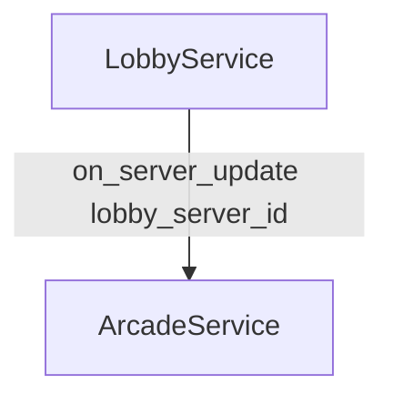
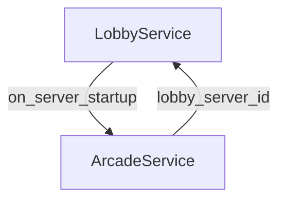
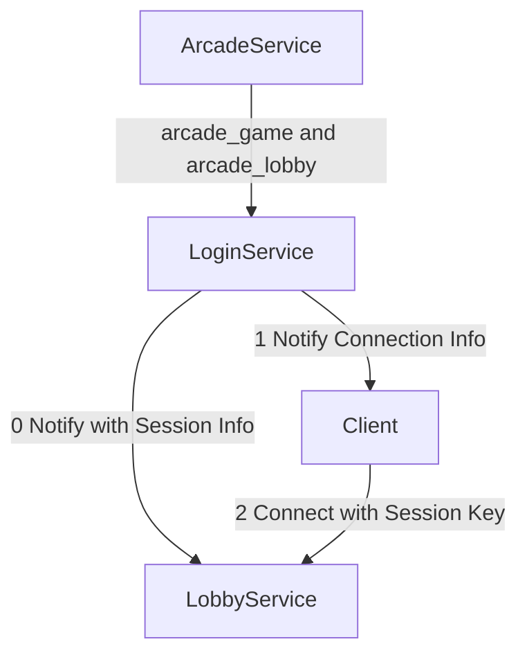

## Blazium Arcade

This is the service that controls the other services: BlaziumLobby, BlaziumLogin, etc. and connects them.

- On Periodic Update



- On Startup



- Example of Lobby to LobbyServerID mapping:

```
   LobbyService1 --> LobbyServerID1
   LobbyService2 --> LobbyServerID2
   LobbyService3 --> LobbyServerID3
```

- Arcade Game Startup + Login Details


