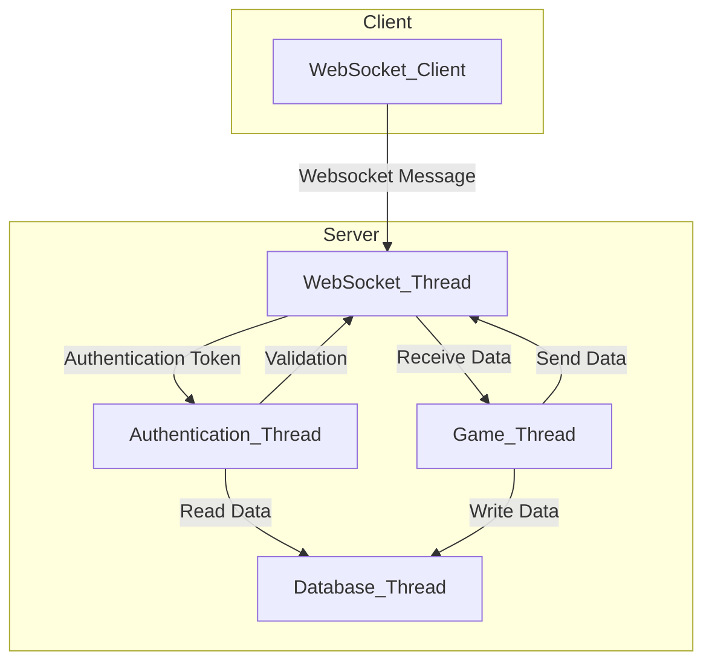

# Tiny Lobby

|[Website](https://appsinacup.com)|[Discord](https://discord.gg/56dMud8HYn)|[Documentation](https://github.com/appsinacup/documentation_lobby)|[Build Locally](./BUILD_LOCALLY.md)
|-|-|-|-|


Multiplayer C++ Lobby Server that starts a websocket server with scripting in Luau and AngelScript.

- [addon_tiny_lobby_client](https://github.com/appsinacup/addon_tiny_lobby_client): Godot Tiny Lobby Client

## Usage

Run locally by downloading latest [GitHub Release](https://github.com/appsinacup/tiny_lobby/releases) and running it in terminal:

```sh
tiny_lobby
```

Or start it with docker by running:

```sh
docker pull ghcr.io/appsinacup/tiny_lobby:latest
docker run -p 8080:8080 ghcr.io/appsinacup/tiny_lobby:latest
```

For more info go to the [Tiny Lobby Documentation](https://github.com/appsinacup/documentation_lobby) page.

## Architecture

Tiny Lobby is designed for scalability and performance using a multi-threaded architecture and lockfree queues.



- WebSocket Thread: Handles all client connections and message routing.
- Game Thread: Manages lobby state and logic.
- Database Thread: Handles database operations.
- Authentication Thread: Processes login and token validation.

## Features

Tiny Lobby provides a rich set of features, sent as messages that can be batched. Messages are typically sent as JSON objects with short keys for efficiency. Each message includes a command type, relevant data, and optional metadata.

### Lobby Management

Any peer can:

- Create a new lobby.
- Join a lobby and receive its state.
- Leave the lobby.
- Get lobby public data.
- Get lobby tags
- Get a list of lobbies.
- Receive notification when a peer joins.
- Receive notification when a peer leaves.
- Receive notification when a peer is kicked.
- Call lobby scripted functions.

Only the host of a lobby can:

- Change lobby sealed (locked/open) state.
- Change max players.
- Set or remove lobby password.
- Change lobby title.
- Set lobby tags.

### Peer Management

Peers are able to:
- Receive initial state
- Set or unset ready state.
- Set or update user data.
- Send chat messages.
- Receive notification when a peer reconnects or disconnects.
- Receive notification when a peer sets user data.
- Receive notification when a peer public data is updated, or when own private data is updated.
- Receive chat messages.
