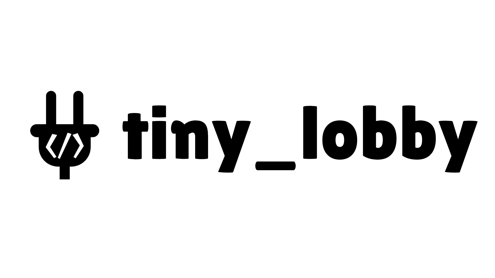

<p align="center">
	 
	<h1 align="center">Tiny Lobby Server</h1> 
</p>

|[Website](https://appsinacup.com)|[Discord](https://discord.gg/56dMud8HYn)|[Starter Project](https://github.com/appsinacup/tiny_lobby_starter)|[Tiny Lobby Godot](https://github.com/appsinacup/addon_tiny_lobby_client)
|-|-|-|-|

|[Documentation](https://github.com/appsinacup/documentation_lobby)|[Build Locally](./BUILD_LOCALLY.md)|[Architecture](./ARCHITECTURE.md)
|-|-|-|

Tiny Lobby is a lightweight multiplayer lobby system for WebSocket-based games, allowing peers to create, join, and manage lobbies, exchange data, and communicate in real time. It also supports backend scripting in Lua, enabling custom game logic directly on the server.


## Features

- Write backend game logic in Lua that runs directly on the lobby server.
- Create, join, or leave a lobby.
- Get lobby public data, tags, and a list of lobbies.
- Receive the lobby state and notifications for peer join/leave/kick events.
- Call lobby scripted functions.
- Lock/unlock the lobby.
- Change max players, title, password, or tags.
- Set ready state and update user data.
- Send/receive chat messages.
- Get notifications for peer reconnect/disconnect, user data changes, and public/private data updates.

## Usage

Run locally by downloading latest [GitHub Release](https://github.com/appsinacup/tiny_lobby/releases) and running it in terminal:

```sh
tiny_lobby
```

Or start it with docker by running:

```sh
docker pull ghcr.io/appsinacup/tiny_lobby:latest
docker run -p 8080:8080 ghcr.io/appsinacup/tiny_lobby:latest
```

For more info go to the [Tiny Lobby Documentation](https://github.com/appsinacup/documentation_lobby) page.
