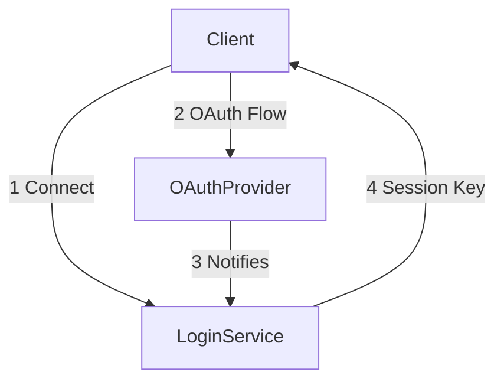
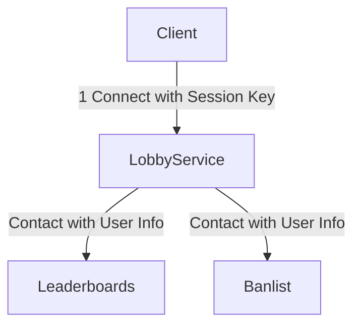

## Blazium Login Authentication

The Authentication Flow between client and login service and the authentication provider (discord/steam/etc.). The outcome of this step is the Session Key.

## Blazium Lobby Connect

After the user is authenticated, he connects to the `LobbyService` as an authenticated user. Now the `LobbyService` can make calls on his behalf.

